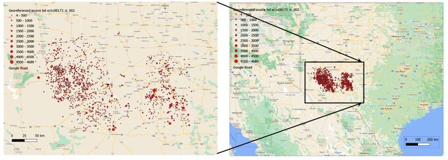
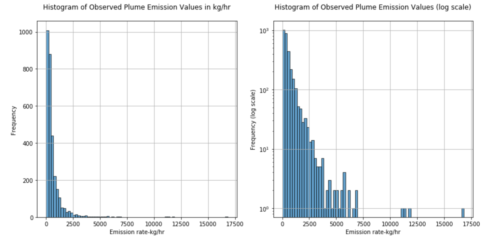
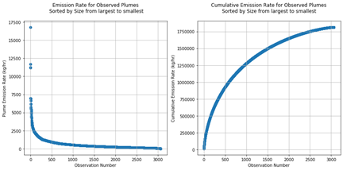
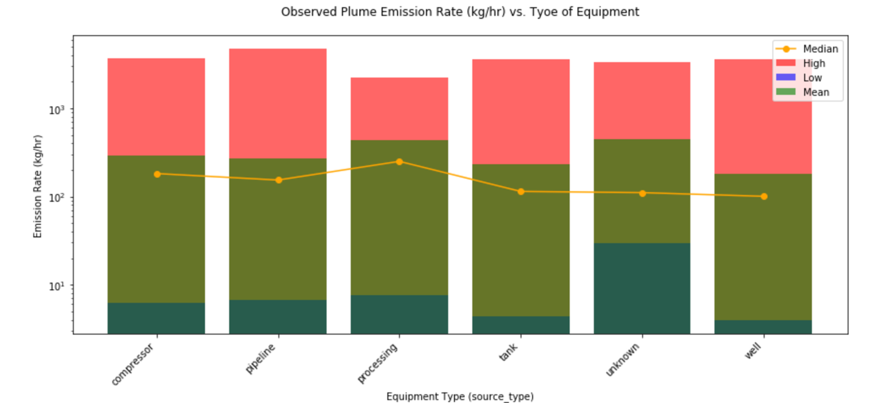
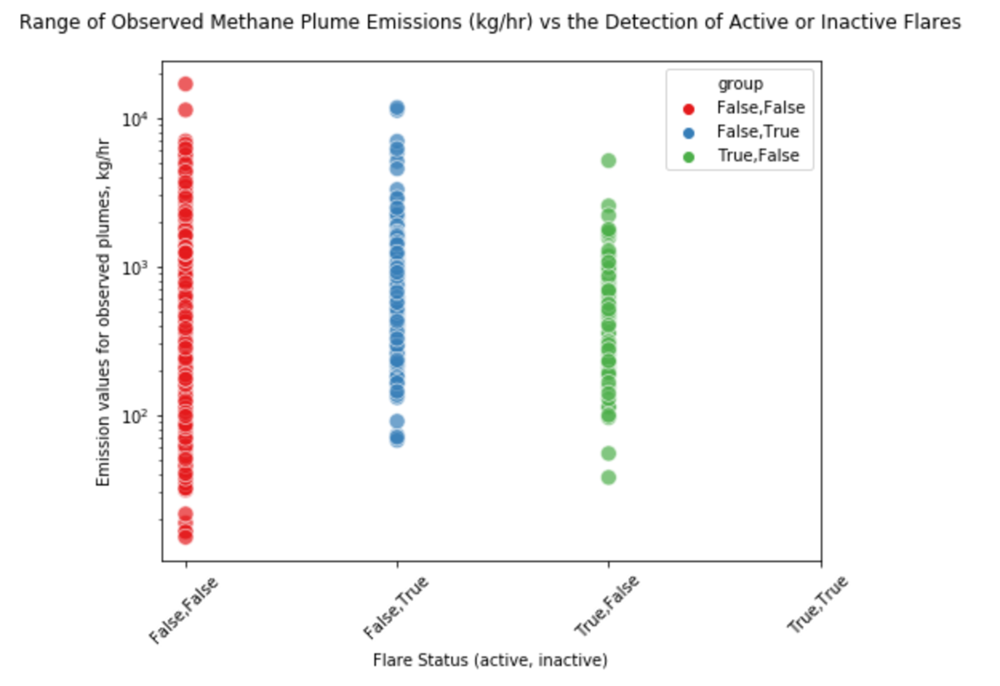
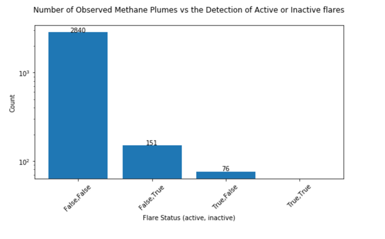

# Methane the Other Greenhouse Gas 
by Theodore van Kessel

Carbon dioxide takes center stage when we discuss greenhouse gasses and global warming. Methane, the other gas that is less discussed, 
is almost as significant as carbon dioxide relative to global warming. According to the Environmental Defense Fund 25% of today's global 
warming is driven by methane from human actions [1]. 
Of these emissions approximately 29% are from oil and gas operations with the remaining contributions coming from 
agriculture (enteric fermentation) and many other sources. 

just added pictues try 3

